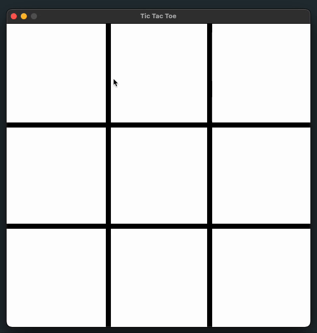

# Tic Tac Toe Game



## Overview

This is a simple implementation of the classic Tic Tac Toe game. The game is played on a 3x3 grid where two players take turns marking the spaces in the grid with their respective symbols (X and O). The player who succeeds in placing three of their marks in a horizontal, vertical, or diagonal row wins the game.

## Features

- Two-player mode
- Simple and intuitive user interface
- Win detection for rows, columns, and diagonals
- Draw detection when the grid is full and no player has won

## How to Play

1. The game starts with Player 1 (X) making the first move.
2. Players take turns clicking on an empty cell in the grid to place their mark (X or O).
3. The game checks for a win condition after each move.
4. If a player gets three of their marks in a row (horizontally, vertically, or diagonally), they win the game.
5. If all cells are filled and no player has won, the game ends in a draw.

## Installation

To run the Tic Tac Toe game, follow these steps:

1. Clone the repository:

```sh
git clone https://github.com/yourusername/tic-tac-toe.git
```

2. Navigate to the project directory:

```sh
cd tic-tac-toe
```

3. Open the `index.html` file in your web browser to start the game.

## Contributing

Contributions are welcome! If you have any suggestions or improvements, please create an issue or submit a pull request.

## License

This project is licensed under the MIT License. See the [LICENSE](LICENSE) file for more details.
